Introducción
============

Este manual tiene como objetivo presentar el uso del programa de
marcación [Markup](markup.html)

Recomendaciones para asignar el atributo "ID"
=============================================

El atributo "ID" se usa para identificar algunos elementos como figuras,
tablas, afiliaciones, etc. Este atributo permite establecer referencias
cruzadas entre la mención del elemento en el texto y el elemento en sí.
Para determinar el "ID" de un elemento, combine el prefijo del tipo de
elemento y un número entero como se muestra a continuación:

  -------------------------------------------------------------------------
  Elemento              Descripción             Prefijo  Ejemplo
  --------------------- ----------------------- -------- ------------------
  aff                   Afiliación              aff      aff1, aff2, ...

  app                   Apéndice                app      app1, app2, ...

  fngrp                 Notas al pie del        fn       fn1, fn2, ...
                        artículo                         

  boxedtxt              Caja de texto           bx       bx1, bx2, ...

  corresp               Correspondencia         c        c1, c2, ...

  deflist               Lista de definiciones   d        d1, d2, ...

  equation              Ecuaciones              e        e1, e2, ...

  figgrp                Figuras                 f        f1, f2, ...

  glossary              Glosario                gl       gl1, gl2, ...

  media                 Multimedia              m        m1, m2, ...

  ref                   Referencia              r        r1, r2, ...
                        bibliográfica                    

  subdoc                subdocumento            s        s1, s2, ...

  supplmat              Material suplementario  suppl    suppl1, suppl2,
                                                         ...

  tabwrap/fntable       Notas al pie de tabla   TFN      TFN1, TFN2, ...

  tabwrap               Tabla                   t        t1, t2, ...
  -------------------------------------------------------------------------

Datos básicos
=============

Estando el archivo del documento formateado de acuerdo con las
indicaciones del manual [Preparación de archivos para el programa
Markup](http://www.scielo.org.mx/avaliacao/SciELO_Manual_XML_Preparacion_de_archivos.pdf)
, abra el documento en el programa [Markup](markup.html) y seleccione el
elemento \[doc\]:

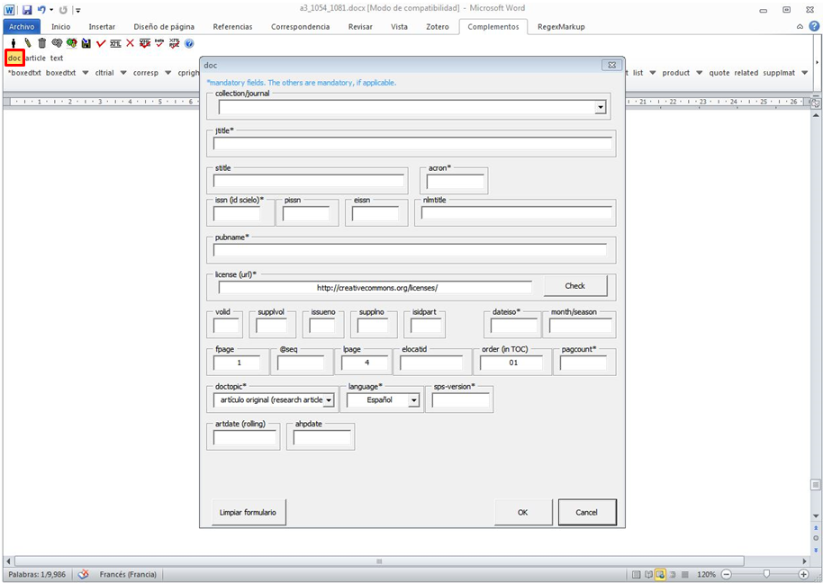{height="400px"}

Al hacer clic en \[doc\] el programa abrirá un formulario, complete los
datos básicos del artículo:

Localice la revista en el campo "collection/journal" y selecciónela, el
programa llenará algunos datos automáticamente como ISSNs, título
abreviado, acrónimo, entre otros. Los demás datos deberán llenarse
manualmente de acuerdo con las siguientes indicaciones:

  ------------------------------------------------------------------------
  Campo        Descripción
  ------------ -----------------------------------------------------------
  license      Si no se inserta automáticamente, llene con la URL de la
               licencia creative commons adoptada por la revista. Consulte
               las licencias en:
               <http://docs.scielo.org/projects/scielo-publishing-schema/>

  volid        Inserte volumen, si lo hay. Para Ahead of Print, no incluya
               volumen

  supplvol     Cuando se trate de un suplemento de volumen incluya su
               parte o número correspondiente. **Ejemplo: vol.12 supl.A**,
               llene con **A**, este campo

  issueno      Ingrese el número del fascículo. Cuando se trate de un
               artículo publicado en ahead of print, inserte ahead en este
               campo

  supplno      Cuando se trate de un suplemento un suplemento de fascículo
               incluya su parte o número correspondiente. **Ejemplo: n.37,
               supl.A**, llene con **A** este campo

  isidpart     Use este campo cuando se trate de un press release, incluya
               la sigla pr

  dateiso      Fecha de publicación formada por año, mes y día
               **(YYYYMMDD)**. Llene siempre con el último mes de la
               periodicidad. Por ejemplo, si la revista es bimensual
               escriba **20140600**. Use **00** para mes y día cuando no
               se cuente con esta información. **Ejemplo: 20140000**.

  month/season Ingrese el mes o mes inicial/mes final, en inglés (tres
               letras) y punto, excepto para May, June y July. **Ej.:
               May/June, July/Aug.**

  fpage        Primera página del documento. Para artículo en Ahead of
               Print, incluya 00

  @seq         Para artículos que inician en la misma página de un
               artículo anterior, incluya la secuencia con letra

  lpage        Ingrese la última página del documento.

  elocatid     Incluya la identificación electrónica del documento. En
               este caso no llenar fpage y lpage

  order (in    Incluya el orden del artículo en la tabla de contenido del
  TOC)         fascículo. Debe tener, como mínimo dos dígitos. Por
               ejemplo, si el artículo fuera el primero de la tabla de
               contenido, llene este campo con **01** y así en adelante.

  pagcount\*   Inserte las páginas totales del artículo. Para Ahead of
               Print, escriba el valor 1

  doctopic\*   Indique el tipo de documento que se va a marcar. Por
               ejemplo: artículo original, reseña, carta, comentario etc.
               En el caso de Ahead Of Print, incluya siempre el tipo
               artículo original, excepto para errata

  language\*   Seleccione el idioma principal del texto a ser marcado

  version\*    Identifique la versión de la DTD usada en el proceso de
               marcación (La versión actual es 4.0)

  artdate      Es obligatorio escribir la fecha **YYYYMMDD** cuando se
  (rolling)    trate de un artículo rolling pass. Rolling pass es un
               modelo publicación dónde la revista publica sus artículos
               en un volumen único conforme estos quedan listos

  ahpdate      Indique la fecha de publicación de un artículo publicado en
               ahead of print
  ------------------------------------------------------------------------

> **note**
>
> Los campos que tienen un asterisco al lado, son obligatorios.

Front
=====

Una vez que se completó el llenado del formulario, al hacer clic en
\[Ok\] se abrirá una ventana preguntando si el documento tiene el
formato adecuado para efectuar la marcación automática:

{height="450px"}

Al hacer clic en \[Sí\], el programa realizará la marcación automática
de los elementos básicos del documento.

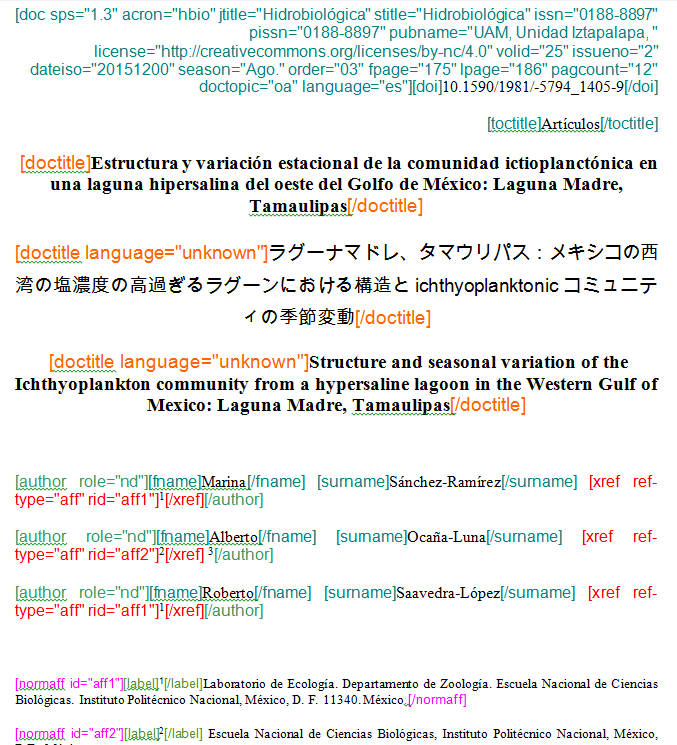{width="300px" height="400px"}

> **note**
>
> Si el archivo no tiene el formato recomendado en "Preparación de
> Archivos para el Programa Markup", el programa no identificará
> correctamente los elementos.

Después de la marcación automática es necesario completar la marcación
de los elementos básicos.

Doctitle
--------

Verifique que el idioma insertado en \[doctitle\] para títulos
traducidos sea correcto, si es necesario corrija. Para corregir,
seleccione el elemento incorrecto y haga clic en el ícono del "lápiz"
para editar los atributos:

{height="400px"}

Realice el mismo procedimiento para los demás títulos traducidos.

Autores
-------

Algunos autores presentan más de una referencia al lado de su nombre,
pero el programa solamente hace la marcación automática de una
referencia. Entonces, es necesario seleccionar las demás referencias que
se presenten y marcarlas con el elemento \[xref\].

{height="300px"}

Por tratarse de una referencia cruzada (xref) de afiliación, el tipo de
xref (ref-type) seleccionado fue "affiliation" y el rid (relacionado al
ID) "aff3" para relacionar la referencia 3 con la afiliación
correspondiente.

El programa Markup no realiza la marcación automática de la función del
autor, entendiéndose función como el cargo ejercido. Para marcarlo, es
necesario seleccionar el dato que aparece al lado del nombre del autor,
ir al nivel inferior del elemento \[author\] y marcar ese dato con el
elemento \[role\].

{height="230px"}

{height="230px"}

> **note**
>
> El programa no identifica automáticamente símbolos o letras como
> elemento \[label\], deben marcarse manualmente observando el tipo de
> referencia cruzada a ser incluida.

<iframe width="640" height="360" src="https://www.youtube.com/embed/R8YYjXZSk1c?list=PLQZT93bz3H79NTc-aUFMU_UZgo4Vl2iUH" frameborder="0" allowfullscreen></iframe>
Sig-block
=========

Generalmente archivos Editoriales, Presentaciones etc. poseen al final
del texto la firma del autor o editor. Para identificar la firma del
autor, sea en imagen o en texto, es necesario seleccionar la firma y
marcarla con el elemento \[sigblock\]:

{height="200px"}

Seleccione sólo la firma y márquela con el elemento \[sig\]:

{height="180px"}

El resultado de la marcación de la firma del autor/editor será:

{height="150px"}

> **note**
>
> Algunas firmas presentan al lado del nombre del autor su cargo o
> función. Para la identificación de \[sig\], no considerar la función.

On Behalf
=========

El elemento \[on-behalf\] se utiliza cuando un autor ejerce el papel de
representante de un grupo o de una institución. Para marcar este dato,
verifique que la información del representante del grupo se encuentre en
la misma línea del nombre del autor. Ejemplo:

> Fernando Augusto Proietti ^2^ Interdisciplinary HTLV Research Group

El programa identificará el autor "Fernando Augusto Proietti" de la
siguiente manera:

{height="150px"}

Seleccione el nombre del grupo o institución y márquelo con el elemento:
\[onbehalf\]:

{height="150px"}

Contrib-ID
==========

Para los autores que presentan su registro en ORCID o en Lattes se debe
incluir el link de registro al lado de su nombre, justo como se muestra
en el ejemplo:

{height="230px"}

Al hacer la marcación con \[doc\] el programa identificará
automáticamente todos los datos iniciales del documento, inclusive
marcará el link de registro en \[author\]. Aunque el programa incluya el
link en el elemento \[author\], será necesario completar la marcación de
ese dato.

Para hacerlo, vaya al nivel de \[autor\], seleccione el link del autor y
haga clic en \[author-id\]. En la ventana que abre el programa,
seleccione el tipo de registro del autor: lattes u ORCID y haga clic en
\[Continuar\]

{height="230px"}

Afiliaciones
------------

El programa Markup hace la marcación del grupo de datos de cada
afiliación con el elemento \[normaff\], la marcación detallada de las
afiliaciones no se realiza automáticamente. Complete la marcación de las
afiliaciones identificando: institución mayor \[orgname\], división 1
\[orgdiv1\], división 2 \[orgdiv2\], ciudad \[city\], estado \[state\]
(los 4 últimos, si están presentes) y el país \[country\].

Para hacer la marcación de los elementos arriba mencionados, vaya al
nivel inferior del elemento \[normaff\] y realice la marcación detallada
de cada afiliación.

{height="350px"}

En la secuencia, será necesario verificar si la institución marcada y su
país poseen forma normalizada por SciELO. Para eso, seleccione el
elemento \[normaff\] y haga clic en el ícono del "lápiz" para editar sus
atributos. El programa abrirá una ventana para consultar la
normalización de los elementos que se indiquen en los campos en blanco.

{height="350px"}

En el campo "icountry" seleccione el país de la institución mayor
(orgname), en seguida haga clic en "find" para buscar la institución
normalizada. Al hacer este procedimiento, el programa Markup consultará
la base de datos SciELO de instituciones normalizadas y verificará si la
institución seleccionada se encuentra en la lista.

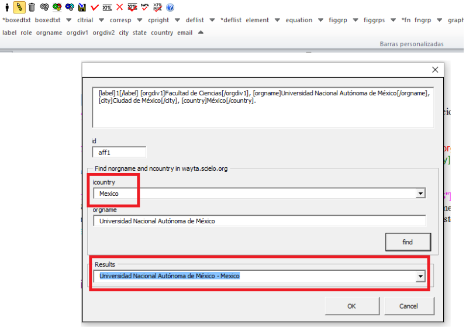{height="350px"}

{height="150px"}

> **note**
>
> Realice la búsqueda de la institución con su nombre en el idioma de
> origen, cuando se trate de lenguas no latinas la consulta deberá
> realizarse en inglés. Si la institución no existe en la lista del
> Markup, seleccione el elemento "No match found" y haga clic en \[OK\].

Resúmenes
=========

Los resúmenes deben ser marcados manualmente. Para marcar resúmenes
simples (sin secciones) y resúmenes estructurados (con secciones)
utilice el elemento \[xmlabstr\]. En la marcación, seleccione el título
del resumen y el texto, en seguida márquelo con el elemento
\[xmlabstr\].

Resumen sin sección:
--------------------

**Seleccionando:**

{height="350px"}

Cuando haga clic en \[xmlabstr\] el programa abrirá una ventana donde
debe seleccionar el idioma del resumen marcado:

*Marcación:*\*

{width="450px" height="350px"}

**Resultado**

En resúmenes estructurados, el programa también marcará cada sección del
resumen y sus respectivos párrafos.

Resumen con sección:
--------------------

Siga los mismos pasos descritos para los resúmenes sin sección:

**Seleccionando:**

**Marcación:**

{height="400px"}

**Resultado**

<iframe width="640" height="360" src="https://www.youtube.com/embed/FVTjDOIGV0Y?list=PLQZT93bz3H79NTc-aUFMU_UZgo4Vl2iUH" frameborder="0" allowfullscreen></iframe>
Keywords
========

El programa Markup cuenta con dos elementos para la identificación de
palabras-clave, \[\*kwdgrp\] y \[kwdgrp\]. El elemento \[\*kwdgrp\], con
asterisco, se usa para la marcación automática de cada palabra-clave y
también del título. Para hacerlo, seleccione toda la información,
incluyendo el título y marque los datos con el elemento \[\*kwdgrp\].

Marcación automática:
---------------------

**Seleccionando:**

{height="300px"}

En la ventana que abre el programa, seleccione el idioma de las
palabras-clave marcadas:

**Marcación:**

{height="300px"}

{height="100px"}

Marcación manual:
-----------------

Si el resultado de la marcación automática no es el esperado, puede
marcar el grupo de palabras-clave manualmente. Seleccione el grupo de
palabras-clave y márquelas con el elemento \[kwdgrp\].

**Marcación:**

{height="350px"}

En seguida, realice la marcación ítem por ítem. A continuación,
seleccione el título de las palabras-clave y márquelo con el elemento
\[sectitle\]:

{height="300px"}

En la secuencia, seleccione palabra por palabra y márquela con el
elemento \[kwd\]:

{height="300px"}

<iframe width="640" height="360" src="https://www.youtube.com/embed/6sNTlHF8WdU?list=PLQZT93bz3H79NTc-aUFMU_UZgo4Vl2iUH" frameborder="0" allowfullscreen></iframe>
History
=======

El elemento \[hist\] es utilizado para marcar el histórico del
documento. Seleccione todos los datos históricos que presente el
documento y márquelos con el elemento \[hist\]:

{height="250px"}

Seleccione la fecha de recibido y márquela con el elemento \[received\].
Compruebe que la fecha ISO indicada en el campo dateiso es correcta,
corrija si es necesario. La estructura de la fecha ISO esperada es: AÑO
MES DÍA.

{height="350px"}

Cuando exista la fecha de revisado, selecciónela y márquela con el
elemento \[revised\]. Haga lo mismo para la fecha de aceptado,
seleccionando el elemento \[accepted\]. Verifique la fecha ISO indicada
en el campo dateiso, corrija si es necesario.

{height="350px"}

<iframe width="640" height="360" src="https://www.youtube.com/embed/w4Bw7dXpS0E?list=PLQZT93bz3H79NTc-aUFMU_UZgo4Vl2iUH" frameborder="0" allowfullscreen></iframe>
Correspondencia
===============

Los datos de correspondencia del autor se marcan con el elemento
\[corresp\]. Este elemento posee un subnivel para marcar el e-mail del
autor. Seleccione toda la información de correspondencia y marque con el
elemento \[corresp\]. Se presentará una ventana para marcar el ID de
correspondencia, en este caso debe ser "c" + el número de orden de la
correspondencia.

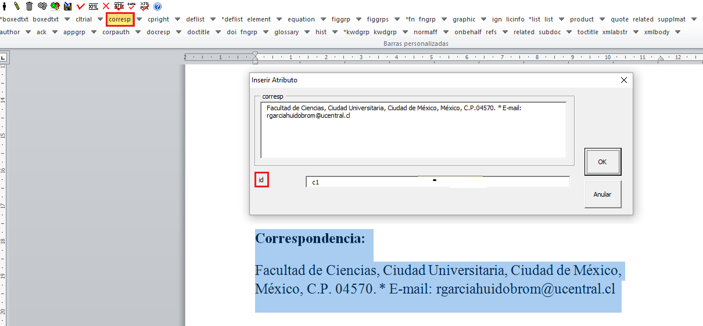{height="300px"}

Seleccione el e-mail que corresponda al autor y marque con el elemento
\[email\]. Suba un nivel para continuar la marcación del siguiente
elemento.

{height="300px"}

<iframe width="560" height="315" src="https://www.youtube.com/embed/fuzSrOMlSvo?list=PLQZT93bz3H79NTc-aUFMU_UZgo4Vl2iUH" frameborder="0" allowfullscreen></iframe>
Ensayo clínico
==============

Archivos que presentan información de ensayo clínico con número de
registro, deben marcarse con el elemento \[cltrial\]:

{height="150px"}

En la ventana que abre el programa, llene el campo "cturl" con la URL de
la base de datos donde el Ensayo fue indexado y en el campo "ctdbid"
seleccione la base correspondiente:

{height="300px"}

Para encontrar la URL del ensayo clínico haga una búsqueda en internet
por el número de registro. Llene los atributos conforme al siguiente
ejemplo:

{height="80px"}

> **note**
>
> Es común que la información de Ensayo clínico se encuentre posicionada
> después de los resúmenes o palabras-clave.

<iframe width="560" height="315" src="https://www.youtube.com/embed/0bln_fugnAA?list=PLQZT93bz3H79NTc-aUFMU_UZgo4Vl2iUH" frameborder="0" allowfullscreen></iframe>
Referencias
===========

Las referencias bibliográficas son marcadas elemento por elemento y su
formato original se conserva para su presentación en el sitio SciELO.

El programa marcará todas las referencias seleccionadas con el elemento
\[ref\]. Inicialmente todas tendrán el tipo \[book\], el cambio del tipo
de referencia será manual o automático dependiendo del tipo de elemento
marcado, como se verá más adelante.

{height="400px"}

{height="400px"}

<iframe width="560" height="315" src="https://www.youtube.com/embed/MoTVIJk21UM?list=PLQZT93bz3H79NTc-aUFMU_UZgo4Vl2iUH" frameborder="0" allowfullscreen></iframe> 
Tipos de referencias
--------------------

A partir de la marcación realizada, algunos tipos de referencia serán
modificados automáticamente, sin intervención manual (ej.: tesis,
conferencia, informe, patente y artículo de revista); en los demás
casos, será necesario cambiarlo manualmente. Para modificar manualmente
el tipo de referencia haga clic en el elemento \[ref\], en seguida otro
clic en el ícono del "lápiz", en "reftype" seleccione el tipo correcto.

{height="400px"}

{width="400px"
height="150px"}

Se recomienda editar "reftype" solamente **después** de marcar todos los
elementos de la \[ref\], ya que dependiendo de los elementos marcados el
"reftype" será cambiado automáticamente por el programa Markup.

> **note**
>
> Una referencia debe tener su tipología siempre basada en su contenido y nunca en su soporte. Por ejemplo, una ley representa un documento legal y el tipo de referencia es "legal-doc", independientemente de que esté publicado en un periódico o en un sitio web. Una referencia de artículo de una revista científica, aunque se haya publicado en un sitio web, es de tipo "journal".
>
> :   Es importante entender estos aspectos en las referencias para
>     poder interpretar su tipología y sus elementos. Ni toda referencia
>     que posee un enlace es una "webpage", ni toda referencia que posee
>     un volumen es un "journal", los libros también pueden
>     tener volúmenes.
>
A continuación se describen los tipos de referencia soportados por
SciELO y la marcación de cada \[ref\].

### thesis

Se usa para referenciar monografías, tesis para obtención de un grado
académico, tales como libre-docencia, doctorado, maestría etc. La
marcación con el elemento \[thesgrp\] determinará el cambio del tipo de
referencia de \[book\] a \[thesis\]. Ej:

> *6. Ferreira Gonzáles, Jesús Emmanuel, 2013, Diálogo entre Maurice
> Merleau-Ponty y Emmanuel Lévinas sobre el problema de la resistencia
> de lo irreflexivo a la reflexión &\#91;tesis doctoral &\#93;, Morelia,
> Universidad Michoacana de San Nicolás de Hidalgo disponible en:
> <http://filos.umich.mx/portal/wp-content/uploads/2013/09/Ferreira-tesis.pdf>
> (consultado en 19/X/2013).*

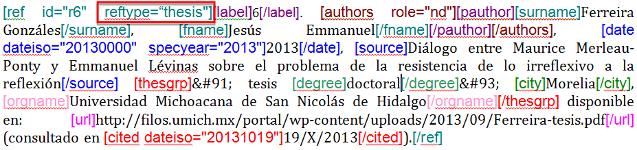{height="200px"}

<iframe width="560" height="315" src="https://www.youtube.com/embed/h1ytjcXZv5U?list=PLQZT93bz3H79NTc-aUFMU_UZgo4Vl2iUH" frameborder="0" allowfullscreen></iframe>
### confproc

Se usa para referenciar documentos relacionados a eventos: actas,
anales, convenciones y conferencias entre otros. Al marcar el elemento
\[confgrp\] el programa cambiará el tipo de referencia a \[confproc\].
Ej.:

> *8. McDougall, Derek and Kingsley, Edney (2007), "Howard's way? Public
> opinion as an influence on Australia's engagement with Asia", Paper
> presented at the anual conference of the Australasian Political
> Studies Association, Monash University, Melbourne.*

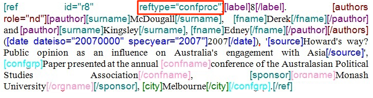{height="250px"}

<iframe width="560" height="315" src="https://www.youtube.com/embed/k0OWNjboFWE?list=PLQZT93bz3H79NTc-aUFMU_UZgo4Vl2iUH" frameborder="0" allowfullscreen></iframe>
### report

Se usa para referenciar informes técnicos, normalmente de autoría
institucional. Al marcar el elemento \[reportid\] el programa cambiará
el tipo de referencia a \[report\]. Ej.:

> *9. Naciones Unidas, Asamblea General (2011), Informe del Grupo de
> Trabajo sobre el Examen Periódico Universal: Myanmar, núm. A/HRC/17/9*

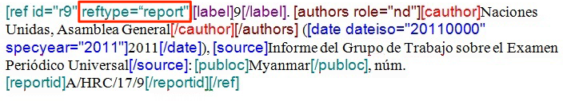{height="250px"}

> **note**
>
> En los casos en que no haya número de informe, el cambio del tipo de
> referencia deberá realizarse manualmente.

### patent

Se usa para referenciar patentes; la patente representa un título de
propiedad que confiere a su titular el derecho de impedir que terceros
exploten su creación. Ej.:

> *19. Torabinejad M, White DJ. Tooth filling material and use.
> Washington, DC: United States Patent & Trademark Office; Patent Number
> 5,769,638, May 16, 1995.*

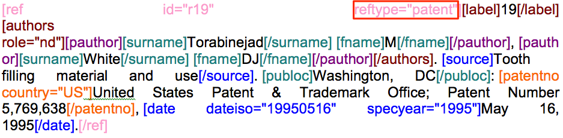

<iframe width="560" height="315" src="https://www.youtube.com/embed/4BffTcmIkF8?list=PLQZT93bz3H79NTc-aUFMU_UZgo4Vl2iUH" frameborder="0" allowfullscreen></iframe>
### book

Se usa para referenciar libros o parte de ellos (capítulos, tomos,
series, etc), manuales, guías, catálogos, enciclopedias y diccionarios
entre otros. Ej.:

> *LORD, A. B. The singer of tales. 4th. Cambridge: Harvard University
> Press, 1981.*

{height="180px"}

<iframe width="560" height="315" src="https://www.youtube.com/embed/geq2_UgMYa0?list=PLQZT93bz3H79NTc-aUFMU_UZgo4Vl2iUH" frameborder="0" allowfullscreen></iframe>
### Libro en impresión

Libros terminados pero que todavía no se publican presentan la
información "en imprenta", "no prelo", "forthcomming" o "in press"
normalmente al final de la referencia. En este caso, la marcación se
realizará de la siguiente manera:

> *CIRENO, F.; LUBAMBO, C. Estratégia eleitoral e eleiciones para Câmara
> dos Deputados no Brasil en 2006, no prelo.*

{height="180px"}

<iframe width="560" height="315" src="https://www.youtube.com/embed/P2fiGsmitqM?list=PLQZT93bz3H79NTc-aUFMU_UZgo4Vl2iUH" frameborder="0" allowfullscreen></iframe>
### Capitulo de libro

Capítulo de libro (título del capítulo y sus respectivos autores, si los
tiene, seguido del título del libro y sus autores) numerado o no.

> *Ibarra Salazar, Jorge y Lida Sotres Cervantes, (2013) “Instituciones
> fiscales como paliativo para enfrentar crisis financieras: el impuesto
> predial en el estado de Coahuila” en Mendoza Cota, Jorge E. (coord.),
> La crisis financiera internacional. Efectos sectoriales en México y en
> su frontera norte. Tijuana, El Colegio de la Frontera Norte, pp.
> 315-354.*

{height="300px"}

### journal

Se usa para referenciar publicaciones seriadas científicas, como
revistas, boletines y periódicos, editadas en unidades sucesivas, con
designación numérica y/o cronológica y destinada a ser continuada
indefinidamente. Al marcar \[arttitle\] el programa cambiará el tipo de
referencia a \[journal\]. Ej.:

> \*1. Alatorre Antonio. "Hacia una edición crítica de sor Juana
> (segunda parte)", en Nueva Revista de Filología Hispánica, 54 (2006):
> 103-142,
> <http://www.huffingtonpost.es/shinzoable/la-tercera-flecha-abenomics-nhoa_b_3545249.html.*>

{height="200px"}

<iframe width="560" height="315" src="https://www.youtube.com/embed/2gD6Ej1v0h4?list=PLQZT93bz3H79NTc-aUFMU_UZgo4Vl2iUH" frameborder="0" allowfullscreen></iframe>
En las referencias que siguen, su tipo deberá ser cambiado manualmente
de \[book\] al tipo que le corresponda.

### legal-doc

Se usa para referenciar documentos jurídicos, incluye información sobre
legislación y jurisprudencia. Ej.:

> *10. Secretaria Del Media Ambiente y Recursos Naturales (SEMARNAT).
> 2010. Norma Oficial Mexicana NOM-059-SEMARNAT-2010, Protección
> ambiental-especies nativas de México flora y fauna
> silvestre-Categorías de riesgo y especificación de una inclusión,
> exclusión o cambio-Lista de especies en riesgo. Diario Oficial de la
> Nación (Segunda sección). Ciudad de México, México.*

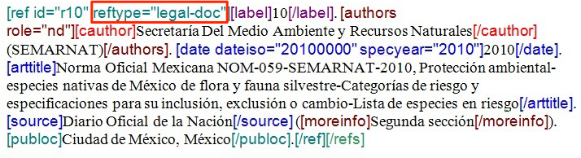{height="180px"}

### newspaper

Se usa para referenciar publicaciones seriadas sin carácter científico,
como revistas y periódicos. Ej.:

> *TAVARES de ALMEIDA, M. H. "Mais do que meros rótulos". Artigo
> publicado no Jornal Folha de S. Paulo, en el día 25/02/2006, na coluna
> Opinião, p. A. 3.*

### database

Se usa para referenciar bases y bancos de datos. Ej.:

> *5. Farr DF ad Rossman AY. 2005. Funga database, sytematic mycology
> and microbiology laboratory, ARS, USDA.
> <http://nr.ars-grin.gov/fungaldatabases/> (consulta marzo 2015)*

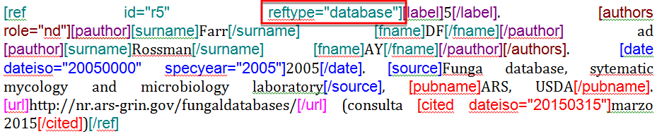{height="100px"}

<iframe width="560" height="315" src="https://www.youtube.com/embed/yXr97tNjDXA?list=PLQZT93bz3H79NTc-aUFMU_UZgo4Vl2iUH" frameborder="0" allowfullscreen></iframe>
### software

Se usa para referenciar un software, un programa de computadora. Ej.:

> *2. BLAST®. Basic Local Aligment Search Tool, Available at:
> <http://blast.ncbi.nml.gov/Blast.cgi>. Accessed on July 13, 2011.*

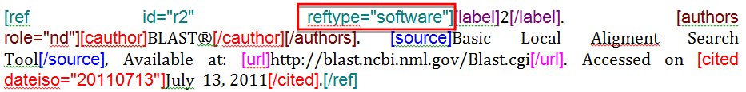{height="200px"}

<iframe width="560" height="315" src="https://www.youtube.com/embed/KMaiNAJ__U4?list=PLQZT93bz3H79NTc-aUFMU_UZgo4Vl2iUH" frameborder="0" allowfullscreen></iframe>
### webpage

Se usa para referenciar, páginas web o información contenida en blogs,
twiter, facebook y listas de discusión entre otros.

**Ejemplo 1**

> *Bosque Los Colomos. (2010). Anexo cartográfico &\#91;consultado Nov
> 2012&\#93;. Disponible en: www.bosqueloscolomos.org.mx*

**Ejemplo 2**

> *BANCO CENTRAL DO BRASIL. Disponivel em: www.bcb.gov.br.*

<iframe width="560" height="315" src="https://www.youtube.com/embed/EwufVmJ4R74?list=PLQZT93bz3H79NTc-aUFMU_UZgo4Vl2iUH" frameborder="0" allowfullscreen></iframe>
### other

Se usa para referenciar tipos no previstos por SciELO. Ej.:

> *INAC. Grupo Nacional de Canto e Dança da República Popular de
> Moçambique. Maputo, \[s.d.\].*

<iframe width="560" height="315" src="https://www.youtube.com/embed/ulL9TlVNcJE?list=PLQZT93bz3H79NTc-aUFMU_UZgo4Vl2iUH" frameborder="0" allowfullscreen></iframe>
"Previous" en referencias
=========================

Hay normas que permiten que las obras que referencian la misma autoría
repetidamente, sean sustituidas por una linea de seis guiones bajos
continuos. Ej.:

*\_\_\_\_\_\_, "Factores institucionales de la disolución de la RFA,
1945-1989", Estudios Políticos (México, unam), vol. 9, núm. 33,
septiembre-diciembre de 2014, pp. 123-151.*

Al hacer la marcación de \[refs\] el programa duplicará la referencia
con previous de la siguiente forma:

> **note**
>
> En referencias que presentan el elemento \[text-ref\], la información
> que se marca debe ser la que está después del \[/text-ref\]. Nunca
> hacer la marcación de la referencia que está entre \[text-ref\] y
> \[/text-ref\].

Para la identificación de referencias con ese tipo de dato, seleccione
los guiones e identifique con el elemento \[\*authors\] con asterisco.
El programa recuperará el nombre del autor previamente marcado y hará la
marcación automática del grupo de autores, marcando el apellido y el
primer nombre.

Marcación automática
--------------------

El programa Markup dispone de una funcionalidad que optimiza el proceso
de marcación de las referencias bibliográficas que siguen la norma
Vancouver. Cuando se hayan hecho adaptaciones a la norma, el programa no
hará la marcación correctamente.

**Seleccione todas las referencias**

**Haga clic en el ícono "Markup: Marcación Automática 2"**

Observe que todas las referencias fueron marcadas automáticamente y de
forma detallada.

Aunque el programa marca automáticamente las referencias, será necesario
revisar cuidadosamente referencia por referencia para verificar si se
marcaron todos los elementos de la referencia correctamente. Si se
requiere alguna corrección, ingrese en el nivel de \[ref\] en "Barras de
Herramientas Personalizadas" y realice las correcciones necesarias y/o
complete las marcaciones faltantes.

> **note**
>
> El uso de la marcación automática en referencias sólo es posible cuando las referencias bibliográficas estén de acuerdo con la norma Vancouver, siguiéndola literalmente.
>
> :   Para las demás normas esta funcionalidad no está disponible.
>
Referencia numérica
-------------------

Algunas revistas presentan referencias bibliográficas numeradas, las
cuales son referenciadas así en el cuerpo del texto. El número
correspondiente a la referencia también debe ser marcado. Después de la
marcación del grupo de referencias, baje un nivel en \[ref\], seleccione
el número de la referencia y marque con el elemento \[label\]:

{height="300px"}

> **note**
>
> el programa Markup no hace la identificación automática de ese dato.

Notas al pie
============

Las notas al pie pueden aparecer antes del cuerpo del texto o después.
No hay una posición fija dentro del archivo .doc. En cualquier caso, es
necesario evaluar la nota, ya que dependiendo del tipo de nota que se
seleccione en fn-type, el programa genera el archivo .xml con
información de notas de autores en `<front>` o en `<back>`. Para más
información acerca de los tipos de nota consulte la documentación de SPS
en
&lt;<http://docs.scielo.org/projects/scielo-publishing-schema/es_BR/1.2-branch/tagset.html#notas-de-autor>&gt;
y&lt;<http://docs.scielo.org/projects/scielo-publishing-schema/es_BR/1.2-branch/tagset.html#notas-gerais>&gt;.

Seleccione la nota y márquela con el elemento \[fngrp\].

{height="350px"}

Cuando la nota presente un título o un símbolo, seleccione la
información y márquela con el elemento \[label\]:

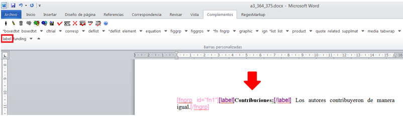{height="200px"}

Tipos de notas
--------------

### Soporte sin información de financiamiento

Para notas al pie que presentan soporte de entidades, institución o
persona física sin datos de financiamiento ni número de contrato,
seleccione la nota del tipo "Investigación en la cual el artículo fue
basado fue apoyado por alguna entidad":

{height="250px"}

<iframe width="560" height="315" src="https://www.youtube.com/embed/a_b9uzylEUU?list=PLQZT93bz3H79NTc-aUFMU_UZgo4Vl2iUH" frameborder="0" allowfullscreen></iframe>
### Soporte con datos de financiamiento

Para notas al pie que presentan datos de financiamiento con número de
contrato, seleccione nota del tipo "Declaración o o negación de
recibimiento de financiamiento en el apoyo de la investigación en la
cual el artículo es basado". En ese caso, será preciso marcar los datos
de financiamiento con el elemento \[funding\]:

{height="300px"}

El siguiente paso es seleccionar el primer grupo de institución
financiadora + el número de contrato y marcar con el elemento \[award\].

{height="200px"}

A continuación, seleccione la institución financiadora y márquela con el
elemento \[fundsrc\]:

{height="200px"}

Seleccione cada número de contrato y márquelo con el elemento
\[contract\]:

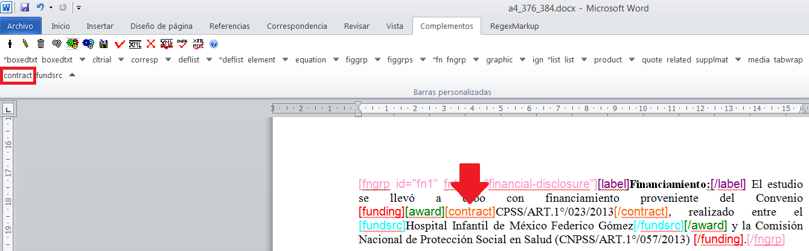{height="300px"}

Si la nota al pie presenta más de una institución financiadora y número
de contrato, haga la marcación conforme al siguiente ejemplo:

{height="300px"}

<iframe width="560" height="315" src="https://www.youtube.com/embed/FVTnNPGqWiU?list=PLQZT93bz3H79NTc-aUFMU_UZgo4Vl2iUH" frameborder="0" allowfullscreen></iframe>
Identificación automática de notas al pie
=========================================

Para notas al pie que están posicionadas al final de cada página en el
documento, con el formato de notas al pie de Word, es posible hacer la
marcación automática del número referenciado en el documento y su nota
respectiva.

Las llamadas de nota al pie en el cuerpo del texto deberán tener un
formateo simple: formato numérico y superíndice. Las notas deberán estar
en formato de nota al pie de Word con un espacio antes de la nota.

{height="300px"}

Ya con el formato correcto, haga clic con el mouse en cualquier párrafo,
y en seguida haga clic en \[\*fn\].

{height="300px"}

Al hacer clic en \[\*fn\] el programa realizará la marcación automática
de \[xref\] en el cuerpo del texto y también de la nota al pie de la
página.

{height="300px"}

Apéndices
=========

La marcación de apéndices, anexos y material suplementario debe ser
hecha con el elemento \[appgrp\]:

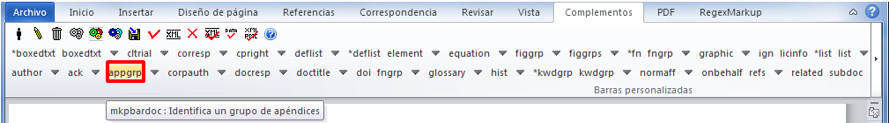{height="100px"}

Seleccione todo el grupo de apéndice, incluso el título, si lo tiene, y
haga clic en \[appgrp\]:

{height="300px"}

Seleccione apéndice por apéndice y marque con el elemento \[app\]

{height="300px"}

> **note**
>
> El ID debe ser siempre único en el documento.

Cuando el apéndice sea una figura, tabla, cuadro etc, seleccione el
título de apéndice y marque con el elemento \[sectitle\]. Utilice los
íconos flotantes (tabwrap, figgrp, \* list, etc) del programa Markup
para identificar el objeto que será marcado.

**Íconos flotantes**

{height="100px"}

Ejemplo, seleccione la figura con su respectivo label y caption y marque
con el elemento \[figgrp\]

{height="300px"}

{width="350px" height="350px"}

> **note**
>
> Asegúrese que el ID de la figura de apéndice es único en el documento.

<iframe width="560" height="315" src="https://www.youtube.com/embed/ZqjFc0Hg4P8?list=PLQZT93bz3H79NTc-aUFMU_UZgo4Vl2iUH" frameborder="0" allowfullscreen></iframe>
Para apéndices que presentan párrafos, seleccione el título del apéndice
y marque con el elemento \[sectitle\]

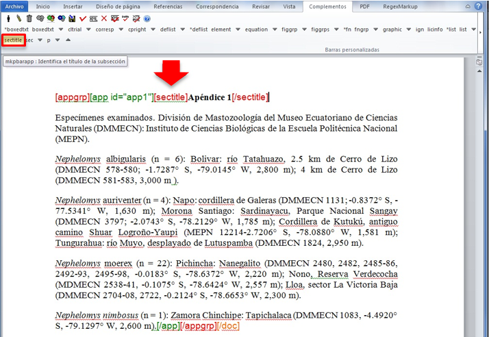{height="300px"}

A continuación, seleccione el párrafo y márquelo con el elemento \[p\]

{height="300px"}

<iframe width="560" height="315" src="https://www.youtube.com/embed/_BM7cKHcWoA?list=PLQZT93bz3H79NTc-aUFMU_UZgo4Vl2iUH" frameborder="0" allowfullscreen></iframe>
Agradecimientos
===============

La sección de agradecimientos, generalmente se encuentra entre el final
del cuerpo del texto y las referencias bibliográficas. Para la marcación
automática de los elementos de agradecimiento seleccione todo el texto,
incluso su título, y marque con el elemento \[ack\].

**Seleccionando \[ack\]**

{height="200px"}

**Resultado esperado**

{height="150px"}

<iframe width="560" height="315" src="https://www.youtube.com/embed/sxZlGq4vwhk?list=PLQZT93bz3H79NTc-aUFMU_UZgo4Vl2iUH" frameborder="0" allowfullscreen></iframe>
Comúnmente los agradecimientos presentan datos de financiamiento, con
número de contrato e institución financiadora. Cuando estén presentes
estos datos, márquelos con el elemento \[funding\].

{height="200px"}

Seleccione el primer conjunto de institución y número de contrato y
marque con el elemento \[award\]:

{height="200px"}

Seleccione la institución financiadora y marque con el elemento
\[fundsrc\]:

{height="200px"}

> **note**
>
> Si hay más de una institución financiadora para el mismo número de
> contrato, seleccione cada institución con un \[fundsrc\]

Marque el número de contracto con el elemento \[contract\]:

{height="200px"}

*Resultado*

{height="230px"}

Cuando haya más de una institución financiadora y número de contrato,
márquelas como se muestra a continuación:

{height="230px"}

<iframe width="560" height="315" src="https://www.youtube.com/embed/P-uM3_bpS1Q?list=PLQZT93bz3H79NTc-aUFMU_UZgo4Vl2iUH" frameborder="0" allowfullscreen></iframe>
Glosario
========

Los glosarios son incluidos en los documentos después de las referencias
bibliográficas, en apéndices o cajas de texto. Para marcarlo, seleccione
todos los ítems que lo componen y márquelos con el elemento
\[glossary\]. Seleccione todos los ítems nuevamente y márquelos con el
elemento lista-definición. El siguiente es un ejemplo de marcación de un
glosario localizado después de las referencias bibliográficas:

{height="200px"}

Seleccione todos los datos del glosario y márquelos con el elemento
lista-definición:

{height="200px"}

El resultado de la marcación será:

{height="200px"}

xmlbody
=======

Con el cuerpo del texto formateado de acuerdo con las instrucciones de
[Preparación de
archivos](http://www.scielo.org.mx/avaliacao/SciELO_Manual_XML_Preparacion_de_archivos.pdf)
y después de haber realizado la marcación de referencias bibliográficas,
es posible iniciar con la marcación de \[xmlbody\].

Seleccione todo el cuerpo del texto y haga clic en el botón \[xmlbody\],
verifique las secciones, subsecciones, citas, etc. presentadas en la
ventana que abre el programa, y si es necesario corrija y haga clic en
"Aplicar".

{height="300px"}

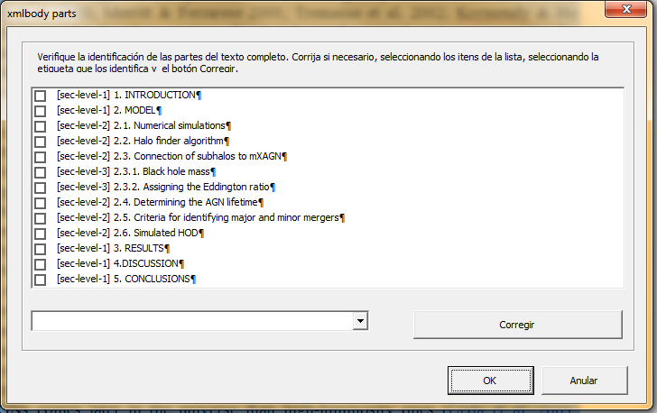{width="350px"
height="350px"}

> **note**
>
> En caso que alguna información sea incorrecta, seleccione el ítem a
> ser corregido en la ventana, seleccione la opción correcta en el menú
> desplegable al lado del botón "Corregir", haga clic en "Corregir".
> Verifique nuevamente y haga clic en "Aplicar".

Al dar clic en "Aplicar" el programa preguntará si las referencias en el
cuerpo del texto se ajustan al patrón de citación autor-fecha. Si el
documento presenta este patrón, haga clic en \[Sí\], en caso contrario
haga clic en \[No\].

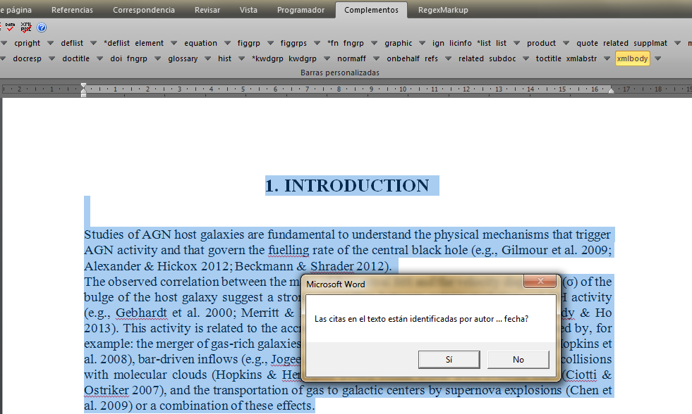{height="300px"}

**Patrón autor-fecha**

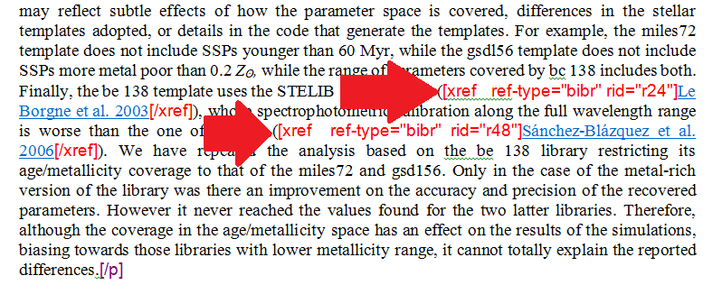{height="200px"}

**Patrón numérico**

{height="250px"}

Es a partir del documento formateado de acuerdo con las instrucciones de
[Preparación de
archivos](http://www.scielo.org.mx/avaliacao/SciELO_Manual_XML_Preparacion_de_archivos.pdf)
que el programa marca automáticamente secciones, subsecciones, párrafos,
referencias de autores en el cuerpo del texto, llamadas a figuras y
tablas, ecuaciones en línea etc.

{width="200px" height="300px"}

{width="200px" height="300px"}

{width="200px" height="300px"}

{width="200px" height="300px"}

{width="200px" height="300px"}

Verifique si los datos fueron marcados correctamente y complete la
marcación de los elementos que no fueron identificados en el documento.

<iframe width="560" height="315" src="https://www.youtube.com/embed/rsz78JNpz44?list=PLQZT93bz3H79NTc-aUFMU_UZgo4Vl2iUH" frameborder="0" allowfullscreen></iframe>
Secciones y subsecciones
------------------------

Después de la marcación automática de \[xmlbody\], cerciórese que los
tipos de secciones fueron asignados correctamente.

En algunos casos, la marcación automática no identifica la sección
correctamente. En esos casos, seleccione la sección, haga clic en el
ícono del "lápiz" "Editar Atributos" e indique el tipo correcto de
sección.

{height="250px"}

**Resultado**

{height="200px"}

> **note**
>
> En el menú desplegable las secciones combinadas inician con un
> asterisco.

<iframe width="560" height="315" src="https://www.youtube.com/embed/P7fu28h7Cws" frameborder="0" allowfullscreen></iframe>
Referencia cruzada de referencias bibliográficas
------------------------------------------------

Las referencias con el patrón autor-fecha serán identificadas
automáticamente en el cuerpo del texto sólo si el apellido del autor y
la fecha están marcados en las *referencias bibliográficas*, y sólo si
el apellido del autor está presente en el cuerpo del texto igual al que
fue marcado en \[refs\]. En algunos casos que el programa Markup no
realizará la marcación automática de \[xref\] en el documento. Ej.:

**Citas de autor**

*Apellido del autor + "in press" o derivados:*

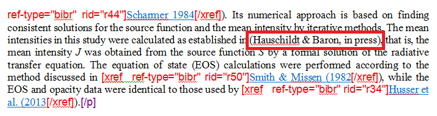{height="200px"}

*Autor corporativo:*

> height
>
> :   150px
>
> align
>
> :   center
>
Para identificar el \[xref\] de las citas que no fueron marcadas
automáticamente, primero identifique el ID de la *referencia
bibliográfica* no identificada, enseguida seleccione la cita deseada y
márquela con el elemento \[xref\].

{height="300px"}

Llene sólo los campos "ref-type" y "rid". En "ref-type", seleccione el
tipo de referencia cruzada que corresponda, en este caso "Referencia
bibliográfica", enseguida indique el ID correspondiente a la referencia
bibliográfica citada. Verifique y haga clic en \[Continuar\].

{height="180px"}

> **note**
>
> No inserte hipervínculos en el dato a ser marcado.

**Llamadas de cuadros, ecuaciones y cajas de texto:**

La marcación de las referencias cruzadas en cuadros, ecuaciones y cajas
de texto sigue el mismo procedimiento descrito en las referencias
bibliográficas.

**Cuadro:**

Seleccione \[ref-type\] de tipo "Figura" e indique la secuencia del ID
en el documento para este elemento.

{height="100px"}

*Resultado*

**Ecuaciones:**

Seleccione \[ref-type\] de tipo "Fórmula" e indique la secuencia del ID
en el documento para este elemento.

*Resultado*

{height="80px"}

**Caja de texto:**

Seleccione \[ref-type\] de tipo "Caja de texto o barra lateral" e
indique la secuencia del ID en el documento para este elemento.

{height="280px"}

*Resultado*

<iframe width="560" height="315" src="https://www.youtube.com/embed/mGncaEawiKA?list=PLQZT93bz3H79NTc-aUFMU_UZgo4Vl2iUH" frameborder="0" allowfullscreen></iframe>
Párrafos
--------

Los párrafos son marcados automáticamente en el cuerpo del texto al
hacer la identificación de \[xmlbody\]. En caso que el programa no haya
marcado un párrafo o que la marcación automática haya identificado un
párrafo con el elemento incorrecto, es posible realizar la marcación
manual de ese dato. Para ello, seleccione el párrafo deseado, verifique
si el párrafo pertenece a alguna sección o subsección y ubique el
elemento \[p\] dentro los niveles de \[sec\] o \[subsec\].

{height="250px"}

*Resultado*

{height="100px"}

<iframe width="560" height="315" src="https://www.youtube.com/embed/wjQ-YiMD6oc?list=PLQZT93bz3H79NTc-aUFMU_UZgo4Vl2iUH" frameborder="0" allowfullscreen></iframe>
Figuras
-------

Al hacer la marcación de \[xmlbody\] el programa identifica
automáticamente las imágenes con el elemento "graphic".

Para marcar el grupo de datos de la figura, seleccione la imagen, su
leyenda (label y caption) y la fuente si existe, marque la selección con
el elemento \[figgrp\].

{height="400px"}

-   Llene el "id" de la figura en la ventana que abre el programa.

{height="200px"}

Cerciórese que el ID de la figura es único en el documento.

{height="400px"}

> **note**
>
> La marcación completa de la figura es de extrema importancia. Si la
> figura no fuera marcada con el elemento \[figgrp\] y sus respectivos
> datos, el programa no generará el elemento \[fig\] correspondiente en
> el documento.

-   Después de la marcación de \[figgrp\], en caso que la imagen
    presente información de fuente, seleccione el dato y márquelo con el
    elemento \[attrib\]:

{height="400px"}

<iframe width="560" height="315" src="https://www.youtube.com/embed/qbE3tLoYr3c?list=PLQZT93bz3H79NTc-aUFMU_UZgo4Vl2iUH" frameborder="0" allowfullscreen></iframe>
> **note**
>
> La marcación de label y caption será automática si el formato está de
> acuerdo con las instrucciones dadas en [Preparación de
> archivos](http://www.scielo.org.mx/avaliacao/SciELO_Manual_XML_Preparacion_de_archivos.pdf),
> con label y caption debajo de la imagen en el archivo .doc. La
> información de fuente debe estar arriba de la imagen.

Tablas
------

Las tablas pueden ser presentadas como imagen o texto. Las tablas
presentadas como imagen deben contener label, caption y notas en texto
(sólo si existen), para que todos los elementos sean marcados. Las
tablas deben estar, de preferencia en formato texto, utilizando figuras
para tablas complejas (con celdas combinadas, símbolos, fórmulas,
imágenes etc).

### Tablas en imagen

Al realizar la marcación de \[xmlbody\] el programa identifica
automáticamente el "graphic" de la tabla. Seleccione todos los datos de
la tabla (imagen, label, caption y notas al pie si existen) y márquelos
con el elemento \[tabwrap\].

Del mismo modo que en las figuras, el ID del elemento deberá ser el
indicado para tablas (t1, t2, t3 ...). Cerciórese que el ID de tabla es
único en el documento.

{width="300px"
height="450px"}

-   Llene el "ID" de la tabla en la ventana que abre el programa.

Cerciórese que el ID de la tabla es único en el documento.

{width="300px" height="450px"}

> **note**
>
> El programa realiza la marcación automática de label, caption y notas
> al pie de tabla.

### Tablas en Texto

El programa también codifica tablas en texto. Para ello, seleccione toda
la información de tabla (label, caption, cuerpo de la tabla y notas al
pie si existen) y márquela con el elemento \[tabwrap\].

{height="350px"}

> **note**
>
> El encabezado de las columnas de la tabla debe estar en negritas. El
> formateo es esencial para que el programa pueda identificar de forma
> correcta el \[thead\] y los elementos que lo componen.

-   Llene el "ID" de la tabla en la ventana que abre el programa.

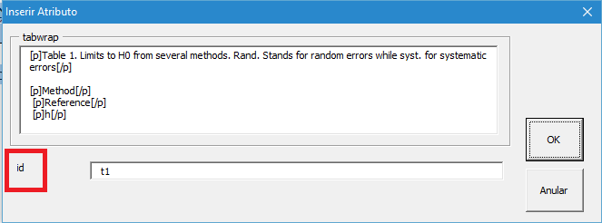{height="200px"}

Cerciórese que el ID de la tabla es único en el documento.

{width="280px" height="400px"}

> **note**
>
> Las tablas irregulares, con celdas combinadas o de gran tamaño
> posiblemente presenten problemas de marcación. En ese caso algunos
> elementos deberán ser identificados manualmente por medio del programa
> Markup o editando directamente el XML cuando se haya generado.

Ecuaciones
----------

Hay dos tipos de ecuaciones soportadas por el programa: las ecuaciones
en línea (en medio de un párrafo) y las ecuaciones en párrafo.

**Ecuación en línea**

Las ecuaciones en línea deben ser insertadas en el párrafo como imagen.
La marcación es hecha automáticamente por el programa al hacer la
identificación de \[xmlbody\].

{height="200px"}

Si el programa no hiciera la marcación automática de la ecuación en
línea, es posible hacer la marcación manualmente. Para ello seleccione
la ecuación en línea y márquela con el elemento \[graphic\].

{height="250px"}

En el campo "href" se agrega el nombre del archivo:

{height="200px"}

El resultado será:

{height="200px"}

**Ecuaciones**

Las ecuaciones presentadas como párrafos deben ser identificadas con el
elemento \[equation\]

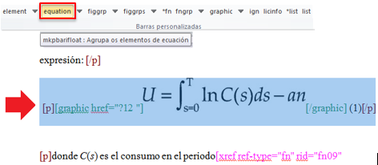{height="200px"}

Llene el "ID" de la ecuación en la ventana que abre el programa.
Cerciórese que el id de la ecuación es único en el documento.

{height="200px"}

Al realizar la marcación de la ecuación, el programa identifica el
elemento \[equation\]. En caso que exista información del número de la
ecuación, márquela con el elemento \[label\].

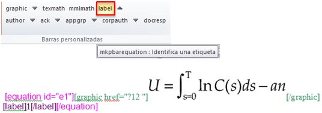{height="200px"}

Cajas de texto
--------------

Las cajas de texto pueden presentar figuras, ecuaciones, listas,
glosarios o un texto. Para marcar este elemento, seleccione toda la
información de la caja de texto incluyendo el label y caption, y
márquela con \[\*boxedtxt\]:

{height="300px"}

Llene el campo de ID de la caja de texto en la ventana que abre el
programa, después de la selección de \[\*boxedtxt\]. Cerciórese que el
ID de boxed-text es único en el documento.

{height="200px"}

Utilizando \[\*boxedtxt\] el programa realiza la marcación automática
del título de la caja de texto y también de los párrafos:

{height="400px"}

Cuando la caja de texto presente una figura, tabla, lista etc, también
es posible utilizar el elemento \[\*boxedtxt\] y después marcar estos
elementos utilizando las etiquetas flotantes del programa.

<iframe width="560" height="315" src="https://www.youtube.com/embed/M52p5PXceL8?list=PLQZT93bz3H79NTc-aUFMU_UZgo4Vl2iUH" frameborder="0" allowfullscreen></iframe>
Marcación de versos
-------------------

Para identificar versos o poemas en el cuerpo del texto, seleccione toda
la información, incluyendo el título y autoría si existe, y márquela con
el elemento \[versegrp\]:

{height="150px"}

El programa identificará cada línea como \[verseline\]. En caso de que
el poema presente título, elimine la marcación de \[verseline\],
seleccione el título y márquelo con el elemento \[label\]. La autoría
del poema debe ser marcada con el elemento \[attrib\].

{height="150px"}

{height="180px"}

<iframe width="560" height="315" src="https://www.youtube.com/embed/2ZmX8mrFjvU?list=PLQZT93bz3H79NTc-aUFMU_UZgo4Vl2iUH" frameborder="0" allowfullscreen></iframe>
Citas textuales
---------------

Las citas son marcadas automáticamente en el cuerpo del texto, al
realizar la marcación de \[xmlbody\], siempre que estén con el formato
adecuado.

{height="200px"}

Cuando el programa no realice la marcación automática, seleccione la
cita deseada y márquela con el elemento \[quote\]:

{height="300px"}

El resultado debe ser:

{height="200px"}

<iframe width="560" height="315" src="https://www.youtube.com/embed/6oRIqNW4S6M?list=PLQZT93bz3H79NTc-aUFMU_UZgo4Vl2iUH" frameborder="0" allowfullscreen></iframe>
Listas
------

Para identificar listas seleccione todos los ítems y márquelos con el
elemento \[\*list\]. Seleccione el tipo de lista en la ventana que abre
el programa:

{width="380px" height="400px"}

Verifique los posibles tipos de lista en elemento-list y seleccione el
más adecuado:

{height="250px"}

<iframe width="560" height="315" src="https://www.youtube.com/embed/6697hJl4H7M?list=PLQZT93bz3H79NTc-aUFMU_UZgo4Vl2iUH" frameborder="0" allowfullscreen></iframe>
> **note**
>
> El programa Markup no realiza la marcación de sublistas. Para saber
> como marcar sublistas, consulte la documentación
> "Markup\_90\_O\_que\_ha\_novo.pdf" sección "Processos Manuais".

El atributo `@list-type` especifica el prefijo a ser utilizado en el
marcador de la lista. Los valores posibles son:

  ------------------------------------------------------------------------
  Valor         Descripción
  ------------- ----------------------------------------------------------
  order         Lista ordenada, cuyo prefijo utilizado es un número o
                letra dependiendo del estilo.

  bullet        Lista desordenada, cuyo prefijo utilizado es un punto,
                barra u otro símbolo.

  alpha-lower   Lista ordenada, cuyo prefijo es un carácter alfabético en
                minúscula.

  alpha-upper   Lista ordenada, cuyo prefijo es un carácter alfabético en
                mayúscula.

  roman-lower   Lista ordenada, cuyo prefijo es un número romano en
                minúscula.

  roman-upper   Lista ordenada, cuyo prefijo es un número romano en
                mayúscula.

  simple        Lista simple, sin prefijo en los ítems.
  ------------------------------------------------------------------------

Listas de definiciones
----------------------

Para marcar listas de definiciones seleccione todos los datos,
incluyendo el título si existe, y márquelos con el elemento
\[\*deflist\]

{height="300px"}

En la ventana que abre el programa, llene el campo de "id" de la lista.
Cerciórese que el id es único en el documento.

{height="200px"}

Confirme la identificación del título de la lista de definiciones y
enseguida la marcación del mismo:

{height="150px"}

{height="150px"}

Al finalizar, verifique si la marcación automática de cada término de la
lista de definiciones está conforme al siguiente ejemplo.

{height="300px"}

> **note**
>
> El programa realiza la marcación automática de cada ítem de la lista
> de definiciones sólo sí la lista está con el formato requerido por
> SciELO: el término en negritas, guión como separador y la definición
> del término sin formato.

Cuando el programa no realice la marcación automática de la lista de
definiciones, es posible identificar los elementos manualmente.

-   Seleccione toda la lista de definiciones y márquelas con el elemento
    \[deflist\], sin asterisco:

{height="300px"}

-   Marque el título con el elemento \[sectitle\] (solo si existe la
    información de título):

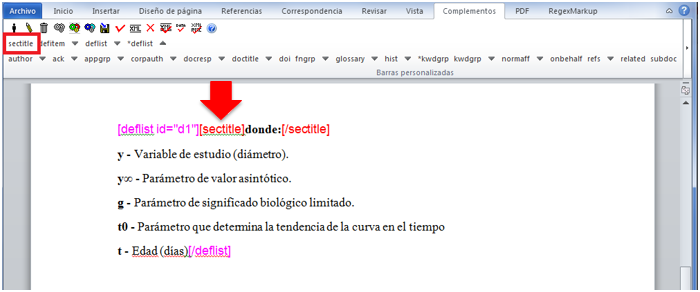{height="250px"}

-   Seleccione el término y la definición y márquelos con el elemento
    \[defitem\]:

{height="250px"}

-   Seleccione solo el término y márquelo con el elemento \[term\]:

{height="80px"}

-   El próximo paso será seleccionar la definición y marcarla con el
    elemento \[def\]:

{height="200px"}

Haga lo mismo con los demás términos y definiciones.

Material suplementario
----------------------

La marcación de materiales suplementarios debe ser hecha con el elemento
\[supplmat\]. El material suplementario puede estar en línea, como un
párrafo "suelto" en el documento o como apéndice.

### Material suplementario en \[xmlbody\]

Seleccione todo contenido del material suplementario, incluyendo label y
caption si existe, y márquelo con el elemento \[supplmat\]:

{height="300px"}

En la ventana que abre el programa, llene el campo de "id", el cual
deberá ser único en el documento, y el campo "href" con el nombre del
archivo .doc:

{height="200px"}

Después realice la marcación de label del material suplementario.
Seleccione todos los datos de la figura y márquelos con el elemento
\[figgrp\]. La marcación deberá quedar conforme al siguiente ejemplo:

{height="300px"}

### Material suplementario en línea

Seleccione la información del material suplementario y márquela con el
elemento \[supplmat\]:

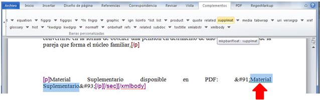{height="180px"}

En la ventana que abre el programa, llene el campo de "id", el cual
deberá ser único en el documento, y el campo "href" con el nombre del
PDF del material suplementario exactamente como esta en la carpeta
"src".

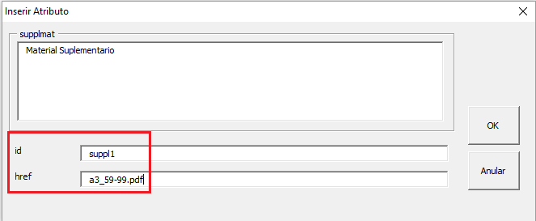{height="200px"}

La marcación deberá ser:

> **note**
>
> Antes de iniciar la marcación de material suplementario cerciórese que
> el PDF del material suplementario se encuentra en la carpeta "src"
> como esta descrito en [Estructura de
> carpetas](es_how_to_generate_xml-prepara.html#estrutura-de-pastas).

### Material suplementario como apéndice

Primero se debe marcar el material suplementario con el elemento
\[appgrp\] y enseguida el elemento \[app\].

> height
>
> :   400px
>
> width
>
> :   350px
>
> align
>
> :   center
>
Seleccione nuevamente todo el contenido del material suplementario y
márquelo con el elemento \[app\]. Enseguida, marque el label del
material con el elemento \[sectitle\]:

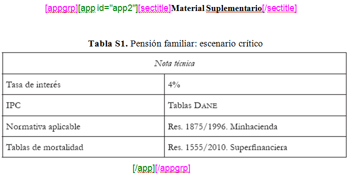{width="350px" height="400px"}

Seleccione el material suplementario y márquelo con el elemento
\[supplmat\]:

{width="350px" height="400px"}

Después de la marcación de \[supplmat\] marque el objeto del material
con las etiquetas flotantes:

{width="350px" height="400px"}

Subdocumentos
=============

Traducciones
------------

Los documentos traducidos presentan un formato específico:

1.  El documento del idioma principal debe seguir el formato indicado en
    [Preparación de
    archivos](http://www.scielo.org.mx/avaliacao/SciELO_Manual_XML_Preparacion_de_archivos.pdf)
2.  Después de la última información en el documento principal y dentro
    del mismo .doc o .docx, agregue la traducción del documento.

La traducción del documento debe ser simplificada:

1.  

    Agregar sólo la información que presente traducción, por ejemplo:

    :   a.  Sección - si existe su traducción
        b.  Autores y afiliaciones - Sólo si existe afiliación traducida
        c.  Resúmenes – si existe su traducción
        d.  Palabras clave - si existe su traducción
        e.  Correspondencia - si existe su traducción
        f.  Notas de autor o del archivo - si existe su traducción
        g.  Cuerpo del texto.

2.  El título es obligatorio;
3.  No agregar nuevamente referencias bibliográficas;
4.  Mantener las citaciones bibliográficas en el cuerpo del texto de
    acuerdo con el PDF.

Vea el siguiente ejemplo:

{width="200px" height="400px"}

{width="200px" height="400px"}

{width="200px" height="400px"}

{width="200px" height="400px"}

{width="200px" height="400px"}

{width="200px" height="400px"}

{width="200px" height="400px"}

### Marcando documentos con traducciones

Con el documento formateado, marque el documento con el elemento \[doc\]
y complete la información. La marcación del documento con el idioma
principal no cambia, siga las instrucciones anteriores para la marcación
de los elementos.

> **note**
>
> Es fundamental que el último elemento del documento completo sea el
> elemento \[/doc\].

Una vez finalizada la marcación del documento con el idioma principal
seleccione toda la traducción y márquela con el elemento \[subdoc\]. En
la ventana que abre el programa, llene los siguientes campos:

-   id - Identificador único del documento: S + nº secuencial
-   subarttp - Seleccionar el tipo de artículo: "translation"
-   language - Idioma de la traducción del documento

{width="600px" height="300px"}

Realice la marcación de la traducción del documento, con los elementos
en nivel de \[subdoc\]:

{width="500px" height="350px"}

> **note**
>
> El programa Markup no realiza la marcación automática del documento
> traducido.

### Afiliación traducida

La marcación de una afiliación traducida es diferente a la marcación del
documento en el idioma principal. Las afiliaciones traducidas no deben
presentar datos detallados. Seleccione la afiliación traducida y
márquela con el elemento \[afftrans\] del nivel \[subdoc\]:

{height="300px"}

Después de haber marcado los datos iniciales de la traducción, continue
con la marcación del cuerpo del texto.

> **attention**
>
> El ID de los autores y afiliaciones deben ser únicos. Por lo tanto, no
> debe poner el mismo ID del idioma principal.

### Marcando 'body' de la traducción

La marcación del cuerpo del texto sigue la mismas instrucciones
anteriores. Seleccione todo el cuerpo del texto y márquelo con el
elemento \[xmlbody\] del nivel \[subdoc\].

El programa realizará la marcación automática de las referencias
cruzadas en el cuerpo del texto agregando el 'rid" correspondiente al
'id' de las referencias bibliográficas marcadas en el documento
principal.

{height="300px"}

Mantenga los RIDs agregados automáticamente. Figuras, tablas,
ecuaciones, apéndices etc deben presentar un ID diferente a los del
documento principal. Para ello, dé continuidad a los IDs, por ejemplo:

**El documento principal presenta 2 figuras:**

{height="350px"}

> **note**
>
> El ID de la última figura es 'f2'.

**En el artículo traducido también hay 2 figuras:**

{height="350px"}

Observe como la secuencia es continua en los IDs de las figuras.
Considere esta regla para: autores y sus respectivas afiliaciones,
figuras, tablas, cajas de texto, ecuaciones, apéndices etc.

> **note**
>
> Cuando exista más de una traducción en el artículo, marque cada una
> con el elemento \[subdoc\].

Carta y respuesta
-----------------

La carta y su respuesta también deben estar en un único archivo .doc o
.docx.

1.  La carta debe seguir el formato indicado en [Preparación de
    archivos](http://www.scielo.org.mx/avaliacao/SciELO_Manual_XML_Preparacion_de_archivos.pdf)
2.  Después de la última información de la carta y dentro del mismo .doc
    o .docx, agregue la respuesta del documento.

La respuesta debe estar en el mismo documento que la carta. A
continuación se muestran los datos que deben estar presentes en la
respuesta:

1.  Agregar sección
2.  Autores y afiliaciones si existen
3.  Correspondencia si existe
4.  Notas de autor o del archivo si existen
5.  El título es obligatorio
6.  Referencias bibliográficas, si están presentes en la respuesta

Observe el siguiente ejemplo:

\[imagen\]

### Marcando carta y respuesta

Con el archivo formateado, marque el documento con el elemento \[doc\] y
complete la información. Obs.: En \[doctopic\] seleccione el tipo
"carta". La marcación de la carta no cambia, siga las instrucciones
anteriores para la marcación de los elementos.

{height="450px"}

> **note**
>
> Es fundamental que el último elemento del documento completo sea el
> elemento \[/doc\].

Una vez finalizada la marcación de la carta, seleccione todo el
contenido de la respuesta y márquelo con el elemento \[subdoc\]. En la
ventana que abre el programa, llene los siguientes campos:

-   id - Identificador único del documento: S + nº secuencial
-   subarttp - Seleccionar el tipo de artículo: "reply"
-   language - Idioma de la respuesta a la carta.

> **note**
>
> El programa Markup no realiza la marcación automática de la respuesta.

Realice la marcación de la respuesta del documento, con los elementos en
nivel de \[subdoc\]:

> **note**
>
> Los datos como: afiliaciones y autores, objetos en el cuerpo del texto
> y referencias bibliográficas deben presentar IDs secuenciales,
> siguiendo el orden de la carta. Ejemplo, si la última afiliación de la
> carta fue "aff3", en el documento de la respuesta la primera
> afiliación será "aff4" etc.

Errata
======

Para marcar una errata, primero verifique que el archivo éste formateado
correctamente de acuerdo a las siguientes instrucciones:

-   1ª línea: DOI
-   2ª línea: Sección "Errata" o "Erratum"
-   3ª línea: Título "Errata" o "Erratum" (de acuerdo al PDF)
-   Saltar 2 líneas
-   Cuerpo del texto

{height="300px"}

Marcando la errata
------------------

Abra la errata en el programa Markup y márquela con el elemento \[doc\].
Al abrir el formulario, seleccione el título de la revista y verifique
los metadatos que son llenados de forma automática. Complete los demás
campos, y en el campo \[doctopic\] seleccione "errata" y haga clic en
\[OK\]. El programa marcará automáticamente los elementos básicos de la
errata como: sección, número DOI y título:

{height="350px"}

Para finalizar la marcación de la errata, verifique que todos los
elementos fueron identificados correctamente y continue con la
marcación. Seleccione el cuerpo del texto y márquelo con el elemento
\[xmlbody\]:

{height="350px"}

Ponga el cursor del mouse antes del elemento \[toctitle\], y haga clic
en \[related\]. En la ventana que abre el programa, llene los campos:
\[reltp\] (tipo de relación) con el valor "corrected-article" y
\[pid-doi\] (número PID o DOI relacionado) con el número DOI del
artículo que será corregido y haga clic en \[Continuar\]:

{height="200px"}

El programa inserta el elemento \[related\], el cual enlazará al
artículo que presenta el error:

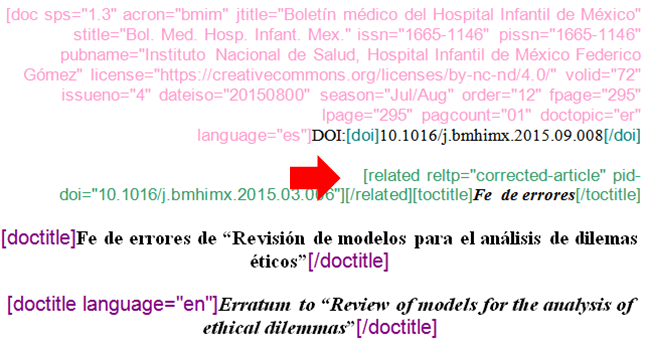{height="300px"}

> **note**
>
> La versión más reciente del programa Markup acepta los tipos: DOI,
> PID, SciELO-PID y SciELO-AID.

Ahead Of Print
==============

El archivo "Ahead Of Print" (AOP) debe estar formateado de acuerdo a las
instrucciones de [Preparación de
archivos](http://www.scielo.org.mx/avaliacao/SciELO_Manual_XML_Preparacion_de_archivos.pdf).
Como los archivos en AOP no presentan sección, volumen, número y
paginación, después del número de DOI debe dejar una línea en blanco, y
enseguida agregar el título del documento:

{height="300px"}

En el formulario para Ahead Of Print, se debe poner el valor "00" en los
campos: \[fpage\], \[lpage\], \[volumen\] e \[issue\].

En \[dateiso\] ponga la fecha de publicación completa: Año+Mes+Día, y en
el campo \[season\] ponga el mes de publicación. El total de páginas
\[pagcount\*\], para archivos AOP siempre debe ser "1":

{height="300px"}

En el campo \[doctopic\] seleccione el valor "artículo original".

En el campo \[order\] se deben poner 5 dígitos que obedezcan a la
siguiente regla de SciELO:

Para construir el ID para AOP se utilizará una parte de la numeración
del fascículo y otra del orden del documento.

*1 - Copie los tres primeros dígitos del fascículo*

Ejemplo el fascículo de la revista Brazilian Journal of Medical and
Biological Research (bjmbr) número 7 del 2015 = fascículo 0715 **usar:
071**

*2- Agregue los dos últimos dígitos que representarán la cantidad de
artículos en el fascículo.*

  Ejemplo el fascículo bjmbr 0715 tiene 5 artículos:
  -------------------------------------------------------------
  1414-431X-bjmbr-1414-431X20154135.xml | -&gt; **usar: 01**
  1414-431X-bjmbr-1414-431X20154316.xml | -&gt; **usar: 02**
  1414-431X-bjmbr-1414-431X20154355.xml | -&gt; **usar: 03**
  1414-431X-bjmbr-1414-431X20154363.xml | -&gt; **usar: 04**
  1414-431X-bjmbr-1414-431X20154438.xml | -&gt; **usar: 05**

El campo order deberá presentar el valor de la siguiente forma:

**3 primeros dígitos del fascículo + 2 dígitos de la cantidad del
fascículo**

Archivo 1:

Archivo 2:

etc.

En el campo \[ahpdate\] ponga la misma fecha que en \[dateiso\]. Después
de llenar todos los datos, haga clic en \[Ok\].

{height="300px"}

> **note**
>
> Al generar el archivo .xml el programa agregará automáticamente el
> elemento &lt;subject&gt; con el valor "Articles", de acuerdo a las
> recomendaciones del SciELO PS.

Publicación continua (Rolling Pass)
===================================

El archivo de Rolling Pass debe estar formateado de acuerdo a las
instrucciones de [Preparación de
archivos](http://www.scielo.org.mx/avaliacao/SciELO_Manual_XML_Preparacion_de_archivos.pdf).

Antes de llenar el formulario de Rolling Pass, se debe saber el formato
de publicación adoptado por la revista, el cual puede ser:

**Volumen y número**

{height="50px"}

**Volumen**

{height="50px"}

**Número**

{height="50px"}

El campo \[order\] esta compuesto por el orden, que se determina por la
sección a la que pertenecen los documentos y el orden de publicación.
Por lo tanto, primero defina una centena para cada sección, por ejemplo:

-   Editorials: 0100
-   Original Articles: 0200
-   Review Article: 0300
-   Letter to the Author: 0400
-   ...

Los artículos deberán presentar un ID único dentro de su sección. Por lo
que es recomendable crear una plantilla que muestre el ID utilizando,
ejemplo:

**Original Articles**

-   1234-5678-rctb-v10-0239.xml 0100
-   1234-5678-rctb-v10-0328.xml 0101
-   **1234-5678-rctb-v10-0356.xml 0102**
-   ...

El identificador electrónico del documento debe ser agregado en el campo
\[elocatid\].

{height="300px"}

> **note**
>
> Los archivos Rolling Pass presentan elocation. Por ello no se debe
> llenar datos correspondientes a \[fpage\] y \[lpage\].

Reseñas
=======

Las reseñas generalmente presentan un dato más que los documentos
comunes: la referencia bibliográfica del libro reseñado. El formato del
documento debe seguir instrucciones disponibles en [Preparación de
archivos](http://www.scielo.org.mx/avaliacao/SciELO_Manual_XML_Preparacion_de_archivos.pdf)
, incluyendo la referencia bibliográfica del documento reseñado antes
del cuerpo del texto.

Ejemplo:

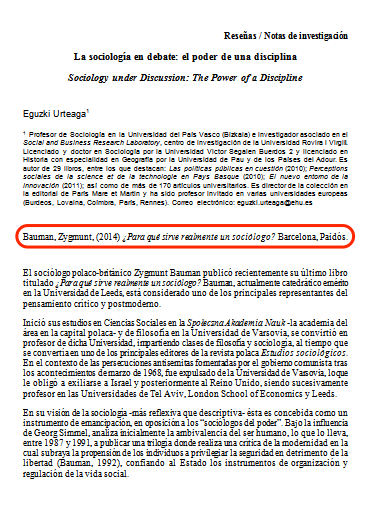{height="500px"}

{height="500px"}

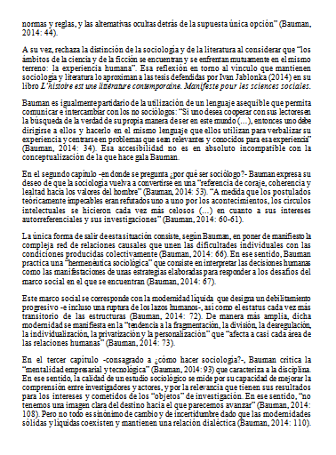{height="500px"}

{height="500px"}

Marcando Reseñas
----------------

Con el documento previamente formateado, realice la marcación de
documento con el elemento \[doc\] y complete los datos. En el campo
\[doctopic\] seleccione "reseña (book review)". La marcación de los
datos iniciales es similar a las instrucciones anteriores, excepto por
la marcación de la referencia del libro reseñado.

Para marcar la referencia del libro, seleccione la referencia completa y
márquela con el elemento \[product\]. En la ventana que abre el
programa, seleccione el tipo de referencia bibliográfica en
\[prodtype\]:

Después realice la marcación de la referencia usando los elementos
presentados del nivel \[prodtype\]:

Termine la marcación del archivo y genere el XML.

> **note**
>
> El programa no muestra todos los elementos para la marcación de
> referencias bibliográficas en el elemento \[product\]. Marque solo los
> datos de la referencia con los elementos disponibles en el nivel
> \[prodtype\].

Artículos en formato corto
==========================

La marcación en formato corto es utilizada sólo en los casos de
inclusión de números retrospectivos en la colección de la revista. El
documento en formato corto tendrá los datos básicos del documento
(título del artículo, autores, afiliaciones, sección, resumen, palabras
clave y las referencias completas). El cuerpo del texto de un documento
en formato corto debe ser eliminado, sustituyendo el texto por los
párrafos:

> *Texto completo disponible sólo en PDF.*
>
> *Full text available only in PDF format.*

{height="200px"}

Marcando formato corto
----------------------

Con el documento previamente formateado, realice la marcación del
documento con el elemento \[doc\] y complete los datos iniciales de
acuerdo con los datos del documento.

En la marcación de archivos en el formato corto no es necesario seguir
orden para la marcación de referencias bibliográficas y \[xmlbody\].
Realice la marcación de referencias bibliográficas de acuerdo con las
instrucciones de referencias:

La marcación de los párrafos se debe hacer con el elemento \[xmlbody\],
seleccionando los párrafos y dando clic en \[xmlbody\]:

> **note**
>
> La única información que no será marcada en los documentos en 'Formato
> corto' será el cuerpo del texto, el cual estará disponible en el PDF.

Press Release
=============

Por ser un texto de divulgación que se utiliza para dar más visibilidad
a un fascículo o artículo publicado en una revista, el press release no
sigue la misma estructura de un artículo científico. Por lo tanto, no
posee sección, número de DOI, y no es obligatorio incluir la afiliación
del autor. Una vez aprobados los 'Press Releases' podrán ser formateados
para una marcación optimizada.

-   1ª línea del documento: Correspondiente al número de DOI, debe
    quedar en blanco.
-   2ª línea del documento: Correspondiente a la sección del documento,
    debe quedar en blanco.
-   3ª línea del documento: Agregue el título del Press Release.
-   4ª línea del documento: Saltar.
-   5ª línea del documento: Agregue el nombre del autor del
    Press Release.
-   6ª línea del documento: Saltar.
-   7ª línea del documento: Agregar la afiliación, si no existe dejar la
    línea en blanco.
-   8ª línea del documento: Saltar.
-   Agregue el texto del documento Press Release, incluyendo la firma
    del autor si existe.

Marcar el Press Release
-----------------------

Con el documento previamente formateado, realice la marcación del
documento con el elemento \[doc\] y considere los siguientes valores:

-   En los campos 'volid' y 'issue' ponga los datos correspondientes al
    fascículo con el que está relacionado el Press Release y en
    'isidpart' ponga el valor 'pr' que identifica al documento como un
    Press Release.
-   En el campo \[doctopic\] seleccione el tipo "press release".
-   Cuando el Press Release esté relacionado con un fascículo, ponga el
    valor "00001" en el campo \[order\] para que el Press Release sea
    posicionado correctamente en la tabla de contenido de la revista.
-   Cuando el Press Release sea de un artículo, ponga sólo el
    valor "01".

Al dar clic en \[OK\] el programa marcará automáticamente todos los
datos iniciales, omitiendo el número de DOI y los demás datos no
presentes en el Press Release.

Complete los demás datos del Press Relase como: \[xref\] de autores,
normalización de afiliaciones (si existen), cuerpo del texto con el
elemento \[xmlbody\] y la marcación de la firma del autor con el
elemento \[sigblock\].

En caso de que el Press Release esté relacionado a un artículo
específico, será necesario relacionarlo al artículo divulgado. Ponga el
cursor del mouse después del elemento \[doc\] y haga clic en el elemento
\[related\]. Después llene los campos 'reltp' (tipo de relación) y
'pid-doi'. En el campo 'reltp' seleccione 'press-release' y en 'pid-doi'
ponga el número de DOI del artículo relacionado.

> **note**
>
> La marcación del elemento \[related\] sólo se realizará en Press
> Releases relacionados a un "artículo".

Procesos manuales
=================

El programa de marcación atiende más del 80% de las reglas establecidas
en el SciELO Publishing Schema. Hay algunos datos que deben ser marcados
manualmente, ya sea en el propio programa Markup o directamente en el
archivo xml generado por el programa.

Afiliación con más de una institución
-------------------------------------

El programa Markup no realiza marcación de afiliaciones con más de una
institución. Si se tiene este caso, los datos deben ser incluidos
directamente en el archivo .xml. Abra el archivo .xml en un editor de
XML e incluya el elemento &lt;aff&gt; con un ID diferente del que ya
consta en el documento:

> **note**
>
> La afiliación incluida manualmente no debe presentar &lt;label&gt; ni
> &lt;institution content-type="original"&gt;, ya que sus datos para
> presentación en el sitio ya están disponibles en la afiliación marcada
> en el programa.

Verifique la segunda institución de la afiliación original y cópiela en
la afiliación nueva haciendo la marcación del dato con el elemento
&lt;institution content-type="orgname"&gt; e &lt;institution
content-type="normalized"&gt;:

Cuando esa institución tenga divisiones, haga la marcación del dato
conforme las demás ya hechas en el documento. En seguida, marque su país
correspondiente con el elemento &lt;country country="xx"&gt;:

El siguiente paso será relacionar esa afiliación &lt;aff id="affx"&gt;
con el autor correspondiente. Considerando que el autor no presenta más
que un label, inserte el elemento &lt;xref&gt; cerrado:

Salve el documento .xml y valide el archivo.

Multimedia
----------

El programa Markup hace también la identificación de medios como:

-   Videos
-   Audios
-   Películas
-   Animaciones

Los archivos deben estar disponibles en la carpeta "src" con el mismo
nombre del archivo .doc, adicionando un guión y el ID del medio.
Ejemplo:

> *Artículo12-m1.wmv*

La marcación de elementos multimedia en el cuerpo del texto debe ser
hecha con el elemento \[media\]. En la ventana que abre el programa,
llene los campos "id" y "href". En el campo "id" inserte el prefijo "m"
+ el número de orden del medio. Ejemplo: m1.

En "href" inserte el nombre del medio con su extensión:
"Artículo12-m1.wmv".

Hecho lo anterior, genere el archivo .xml.

Una vez generado el archivo .xml, verifique los atributos que
identifican el tipo de medio, si hay errores corrija. El programa
presenta los atributos:

-   mime-subtype - especifica el tipo de medio como "video"
    o "application".
-   mimetype - especifica el formato del medio.

Es posible que el programa inserte valores incorrectos en los atributos
mencionados arriba. Ejemplo:

Para corregir, borre el valor "x-ms-wmv" e inserte solamente "wmv", que
es el formato del video. Cuando el atributo @mimetype presente un valor
diferente de "application" o "video", corrija el dato.

Identificación de sublistas
---------------------------

El programa Markup no hace la identificación de sublistas, por lo que es
necesario utilizar un editor de XML para ajustar los ítems de la
sublista. Hay dos métodos para la marcación manual de sublistas:

### Método 1:

En el programa Markup, seleccione toda la lista y márquela con el
elemento \[\*list\], genere el archivo .xml. Con el archivo .xml
generado, localice la lista y realice lo siguiente:

Primero, identifique los ítems de sublista:

Adicione el elemento &lt;list&gt; arriba del primer ítem
&lt;list-item&gt; de la sublista:

Recorte el elemento &lt;/list-item&gt; que está arriba del elemento
&lt;list&gt; de la sublista:

Pegue el elemento &lt;/list-item&gt; recortado justo después del
elemento &lt;/list&gt; de la sublista:

Si la sublista presenta un marcador diferente del insertado en la lista,
es posible adicionar el atributo @list-type en la tag &lt;list&gt; de la
sublista e insertar alguno de los valores siguientes:

-   order
-   bullet
-   alpha-lower
-   alpha-upper
-   roman-lower
-   roman-upper
-   simple

### Método 2:

Cuando la lista y la sublista no hayan sido marcadas en el programa
Markup, es posible que al generar el archivo .xml la lista haya sido
identificada como párrafos. Entonces será necesario hacer la
identificación manual de la lista y de la sublista.

Primeramente, borre todos los párrafos de la lista y sublista y marque
todos los ítems con el elemento &lt;list&gt; adicionando el atributo
@list-type= con el valor correspondiente al marcador de la lista:

Inserte los elementos &lt;list-item&gt; y &lt;p&gt; para cada ítem de la
lista:

Marque los ítems de la sublista:

Adicione un elemento &lt;list&gt; antes del primer elemento
&lt;list-item&gt; de la sublista:

Recorte el elemento &lt;/list-item&gt; que está antes del elemento
&lt;list&gt; de la sublista:

Ahora, pegue el elemento &lt;/list-item&gt; recortado justo después del
elemento &lt;/list&gt; de la sublista:

Leyendas traducidas
-------------------

El programa Markup no hace la marcación de leyendas traducidas en
figuras o tablas. Para hacer la marcación es necesario utilizar un
editor de XML. Verifique la marcación de leyendas de tablas y de figuras
que sigue:

**Tablas**

Abra el archivo .xml en un editor de su preferencia y localice la tabla
que presenta la leyenda traducida.

Inserte el elemento &lt;table-wrap-group&gt; envolviendo toda la tabla,
desde &lt;table-wrap&gt;:

Borre el @id="xx" de &lt;table-wrap&gt; e inserte el atributo de idioma
@xml:lang="xx" con la sigla correspondiente al idioma principal de la
tabla. En seguida, inserte un @id único para el
&lt;table-wrap-group&gt;:

Inserte un nuevo elemento &lt;table-wrap&gt; con &lt;label&gt;,
&lt;caption&gt; y &lt;title&gt; justo después de
&lt;table-wrap-group&gt; con el atributo de idioma @xml:lang="xx"
correspondiente al idioma de la traducción. Inserte la leyenda traducida
en &lt;title&gt;:

> **note**
>
> Para tablas codificadas el proceso es el mismo.

**Figuras**

Abra el archivo .xml en un editor de su preferencia y localice la figura
que presenta la leyenda traducida.

Inserte el elemento &lt;fig-group&gt; envolviendo toda la figura, desde
&lt;fig&gt;:

Borre el @id="xx" de &lt;fig&gt; e inserte el atributo de idioma
@xml:lang="xx" con la sigla correspondiente al idioma principal de la
figura. En seguida, inserte un @id único para el &lt;fig-group&gt;:

Inserte un nuevo elemento &lt;fig&gt; con &lt;label&gt;, &lt;caption&gt;
y &lt;title&gt; justo abajo de &lt;fig-group&gt; con el atributo de
idioma @xml:lang="xx" correspondiente al idioma de la traducción.
Inserte la leyenda traducida en &lt;title&gt;:

Autores sin label
-----------------

Algunos autores no presentan label en autor y en afiliación. Para marcar
el dato, haga la marcación tradicional del autor en el programa Markup e
inserte en afiliación el ID de cada autor. Después de generar el archivo
.xml del documento, ábralo en un editor de XML e inserte la &lt;xref&gt;
cerrada de cada autor.

